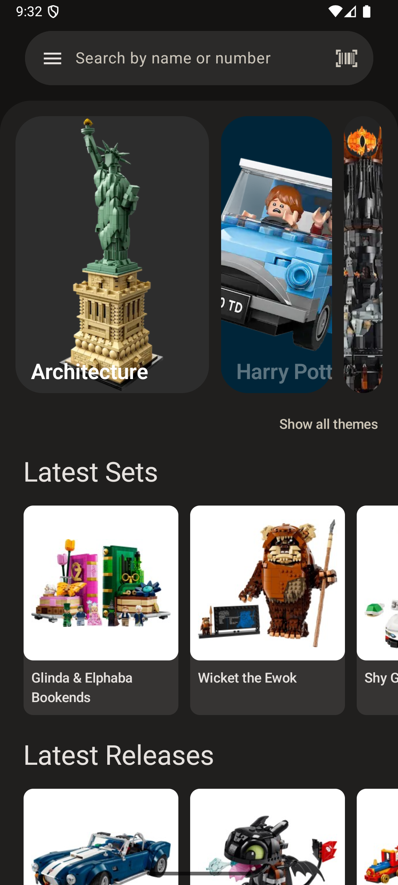

# Bricklog

A simple lego catalog app built
with [Kotlin Multiplatform](https://www.jetbrains.com/help/kotlin-multiplatform-dev/get-started.html).

Supports light mode, dark mode.

(work in progress)

# Screenshots

  
  
  
  
  
  

# Features

- **Offline access:** After the initial download, the whole lego database is available offline.
- **Data sync:** Sync user settings across devices.
- **Notifications:** Get notifications when a new set is available in the database.
- **Favourite sets:** Mark a set as favourite to access it in the favourites list.
- **Set details:** View various details about each set.
- **Set images:** Check out the set images in full screen with zoom support.
- **Fast search:** Search sets by name or filters, and specify the order.
- **Scan barcode and CMF codes:** Scan a set barcode or collectible minifigure box code and access
  its details instantly.
- **Set instructions:** Download set instructions directly from the app.

# Development

  

## Environment setup

### Gradle properties

Configure the following properties in [local.properties](local.properties) or via gradle build
arguments.

Note: To test the app use `DEV_LEVEL=2` and you can skip setting the other variables.

| variable name                 | optional | description                                                                                                                         |
|-------------------------------|----------|-------------------------------------------------------------------------------------------------------------------------------------|
| BRICKSET_API_KEY              | no       | api key can be obtained [here](https://brickset.com/tools/webservices/requestkey)                                                   |
| BRICKLOG_RELEASE_KEYSTORE_PWD | no       | release keystore password                                                                                                           |
| BRICKLOG_RELEASE_KEY_PWD      | no       | release key password                                                                                                                |
| GOOGLE_AUTH_WEB_CLIENT_ID     | no       | necessary for google authentication - available at Firebase or Google Cloud Platform                                                |
| DEV_LEVEL                     | yes      | a level which determines some app behaviours: 0 - production mode 1 - development mode 2 - mock mode 3 - benchmark mode |

#### Android

1. Select the build variant. For example `devDebug`.
   There are build variants for the environments: `prod` and `dev`
2. Build the app.

To use Firebase, download the appropriate `google-services.json` from Firebase and place in
`composeApp` or
`composeApp/src/<environment>` folder.

#### iOS

1. Create a `DevSecrets.xcconfig` and `ProdSecrets.xcconfig` files in `iosApp/Configuration/`
2. Build the project in Android Studio to generate necessary files.
3. Open the iosApp.xcworkspace file in Xcode
4. Build the app

To use Firebase, ownload the appropriate `GoogleService-Info.plist` and place in `iosApp/iosApp`

To use Google Auth, add `GOOGLE_AUTH_IOS_CLIENT_ID_REVERSED=<CLIENT_ID>` to
`iosApp/Configuration/ProdSecrets.xcconfig` or `iosApp/Configuration/DevSecrets.xcconfig`

## Baseline Profile (android)

Generate baseline profile using BaselineProfileGenerator on a rooted emulator.
Run benchmarks on real device.

1. Execute ./gradlew generateReleaseBaselineProfile -PDEV_LEVEL=3
2. Test with benchmarks on real device
3. Copy baseline-prof.txt and startup-prof.txt to `composeApp/src/androidMain` folder

## Troubleshoot

### Android

- If the build variants does not show up, you may need to refresh the project.

- If the build fails due to missing `google-services.json` you can mock Firebase using the
  `DEV_LEVEL=2` gradle property.

### iOS

- On iOS JDK 17 is necessary to build. It can be specified manually
  in [gradle.properties](gradle.properties) via `org.gradle.java.home`.

  Afterwards, build the project and you're ready to use it.

- On iOS the background task can be triggered manually by pausing program execution and type the
  following command:

  `e -l objc -- (void)[[BGTaskScheduler sharedScheduler] _simulateLaunchForTaskWithIdentifier:@"hu.piware.bricklog.sync_sets"]`

  After resuming the task should trigger.

- On iOS sometimes XCode does not recognise files which are not version controlled. You may need to
  add to the project manually.

- If Google Sign-In does not work on iOS check if Secrets.xcconfig is set correctly on project
  configuration tab.

# Technical details

## iOS support

Although the project technically supports iOS builds, it is not distributed on App Store at the
moment and my iOS support is secondary. I used KMP for learning purposes only.

## Set data flow

In order to reduce 3rd party api usage, and make the data availability robust I wrote a
bricklog-data-service kotlin application which scrapes the lego data every day and uploads to a
fileserver as a compressed csv.

If there was any modification since the last data update, it follows these steps:

1. Store modifications in local db.
2. Export db as compressed csv file.
3. Upload file to public fileserver(s) (backup files supported).
4. Update FireStore records with file url and modification date.
5. If there was a new set added, it also sends a notification via FCM.

The mobile client checks on FireStore if there are any modified file uploaded. If yes, it downloads
the file, processes, and stores the data in local sqlite db.
